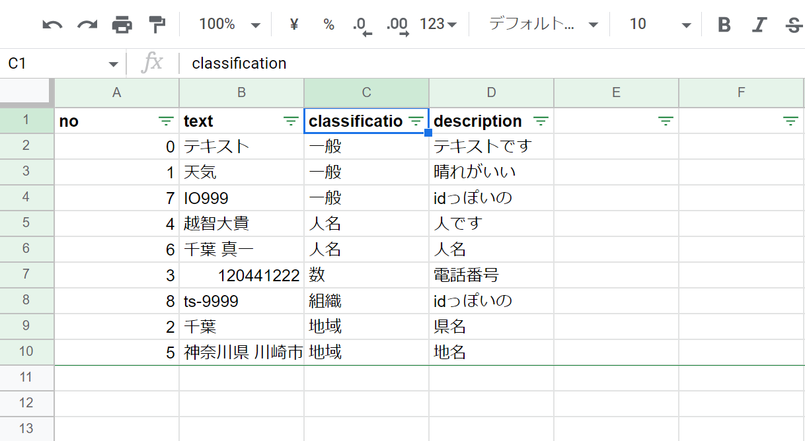

# kaisekisan

## Installation

Go
```console
$ go install github.com/ddddddO/kaisekisan/cmd/kaisekisan@latest
```

Homebrew
```console
$ brew install ddddddO/tap/kaisekisan
```

Scoop
```console
$ scoop bucket add ddddddO https://github.com/ddddddO/scoop-bucket.git
$ scoop install ddddddO/kaisekisan
```

## Usage

```console
$ cat test.csv
no,text,description
0,テキスト,テキストです
1,天気,晴れがいい
2,千葉,県名
3,0120441222,電話番号
4,越智大貴,人です
5,神奈川県 川崎市,地名
6,千葉 真一,人名
7,IO999,idっぽいの
8,ts-9999,idっぽいの

$ kaisekisan test.csv 2
Succeeded!

$ cat test_out.csv
no,text,classification,description
0,テキスト,一般,テキストです
1,天気,一般,晴れがいい
2,千葉,地域,県名
3,0120441222,数,電話番号
4,越智大貴,人名,人です
5,神奈川県 川崎市,地域,地名
6,千葉 真一,人名,人名
7,IO999,一般,idっぽいの
8,ts-9999,組織,idっぽいの
```

### Learn more

このようなcsvファイルがあるとします。ファイル名は xxx.csv とします。
```console
no,text,description
0,テキスト,テキストです
1,天気,晴れがいい
2,千葉,県名
3,0120441222,電話番号
4,越智大貴,人です
5,神奈川県 川崎市,地名
6,千葉 真一,人名
7,IO999,idっぽいの
8,ts-9999,idっぽいの
```

このcsvファイルの2列目`text`列の値がどんな単語であるか調べたいとします。
その場合、`text`列は2番目にあるので、

```console
kaisekisan xxx.csv 2
```

として実行してみてください。すると、 `xxx_out.csv` が出来ます。（`2`はどの列を対象に解析するかを表わしています。）<br>
中身はこのようになっています。

```console
no,text,classification,description
0,テキスト,一般,テキストです
1,天気,一般,晴れがいい
2,千葉,地域,県名
3,0120441222,数,電話番号
4,越智大貴,人名,人です
5,神奈川県 川崎市,地域,地名
6,千葉 真一,人名,人名
7,IO999,一般,idっぽいの
8,ts-9999,組織,idっぽいの
```

xxx.csvと比較すると、text列の右隣に`classification`列が追加されているのが分かります。
この列にtext列の単語の分類が入っています。
これだけだと見づらいので、スプレッドシートか何かに`xxx_out.csv`をインポートして、フィルター作成で並び替えしてみるとより見やすくなるかと思います。


